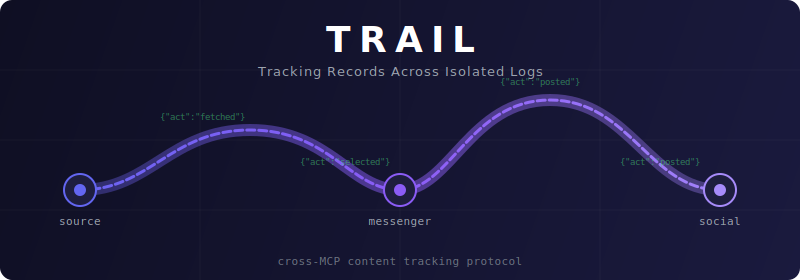

<p align="center">
  
</p>

<p align="center">
  Открытый протокол для кросс-MCP трекинга контента и дедупликации.<br>
  <a href="SPEC.md">Spec (EN)</a> · <a href="SPEC.ru.md">Spec (RU)</a> · <a href="examples/">Examples</a>
</p>

---

## Проблема

У вас несколько [MCP-серверов](https://modelcontextprotocol.io/) — один получает контент, другой постит в Telegram, третий кросс-постит в соцсеть. Каждый сервер изолирован по дизайну. **Ни один сервер не видит другие.**

Попробуйте ответить:
- Эта картинка уже была опубликована в Telegram?
- Пост в соцсеть прошёл или упал?
- Где сломался пайплайн вчера в 3 ночи?

Не получится. Нет стандартного способа отслеживать контент через изолированные MCP-серверы.

**TRAIL решает эту проблему.**

## Как это работает

```
                    LLM-оркестратор (Claude, GPT, и др.)
                   /          |            \
                  /           |             \
         ┌──────────┐  ┌──────────┐  ┌──────────┐
         │ Источник │  │Мессенджер│  │ Соцсеть  │
         │   MCP    │  │   MCP    │  │   MCP    │
         └────┬─────┘  └────┬─────┘  └────┬─────┘
              │              │              │
         trail.jsonl    trail.jsonl    trail.jsonl
```

Каждый сервер ведёт свой `trail.jsonl` — append-only лог с единой схемой. Оркестратор читает все логи и связывает их через универсальный **Content ID** (`content_id`).

**Один прогон пайплайна через три сервера:**

```jsonl
# Источник trail.jsonl
{"version":2,"timestamp":"2026-04-05T14:07:00Z","content_id":"civitai:image:12345","action":"selected","requester":"daily-post","trace_id":"run-001"}

# Мессенджер trail.jsonl
{"version":2,"timestamp":"2026-04-05T14:07:05Z","content_id":"civitai:image:12345","action":"posted","requester":"daily-post","trace_id":"run-001","details":{"platform":"telegram","platform_id":"42"}}

# Соцсеть trail.jsonl
{"version":2,"timestamp":"2026-04-05T14:07:30Z","content_id":"civitai:image:12345","action":"posted","requester":"daily-post","trace_id":"run-001","details":{"platform":"facebook","platform_id":"99"}}
```

Оркестратор видит: `civitai:image:12345` → выбран → запощен в мессенджер (#42) → запощен в соцсеть (#99). Полная цепочка восстановлена через `trace_id`.

## Ключевые особенности

- **Ноль общего состояния** — без баз данных, очередей, межсерверной коммуникации
- **Append-only JSONL** — атомарная запись, нет риска повреждения, тривиальный парсинг
- **Самодокументируемость** — читаемые имена полей: `content_id`, `action`, `requester`, `timestamp`, `version`
- **Универсальный Content ID** — формат `source:type:id` прослеживает контент через любое количество серверов
- **Корреляция трейсов** — опциональный `trace_id` связывает записи между серверами в один пайплайн
- **10 стандартных действий** — `fetched`, `selected`, `posted`, `failed`, `skipped`, `retrying`, `transformed`, `moderated`, `expired`, `delivered`
- **Стандартные инструменты** — `get_trail`, `mark_trail`, `get_trail_stats` — одинаковый API везде
- **Стандартизированные details** — типы ошибок, трекинг стоимости, метаданные контента, ID платформ
- **Автологирование** — инструменты публикации логируют автоматически при передаче `content_id` и `requester`
- **Ноль зависимостей** — только стандартная библиотека
- **Готовность к OTel** — опциональный мост для экспорта записей как OpenTelemetry-спанов

## Быстрый старт

### Python

```python
from trail import Trail

trail = Trail("./data")

# Залогировать событие
await trail.append(
    content_id="civitai:image:12345",
    action="posted",
    requester="daily-post",
    details={"platform": "telegram", "platform_id": "42"},
    trace_id="run-001"
)

# Запросить лог
entries, total = await trail.query(content_id="civitai:image:12345")

# Проверить, уже опубликовано?
if await trail.is_used("civitai:image:12345"):
    print("Уже опубликовано, пропускаем")

# Статистика пайплайна
stats = await trail.stats(requester="daily-post")
print(f"Опубликовано: {stats['by_action'].get('posted', 0)}")
```

### TypeScript

```typescript
import { Trail } from "./trail";

const trail = new Trail("./data");

// Залогировать событие
trail.append("civitai:image:12345", "posted", "daily-post", {
  details: { platform: "telegram", platform_id: "42" },
  trace_id: "run-001",
});

// Запросить лог
const { entries, total } = trail.query({ content_id: "civitai:image:12345" });

// Проверить, уже опубликовано?
if (trail.isUsed("civitai:image:12345")) {
  console.log("Уже опубликовано, пропускаем");
}

// Статистика пайплайна
const stats = trail.stats("daily-post");
console.log(`Опубликовано: ${stats.by_action.posted ?? 0}`);
```

## Схема записи

```jsonl
{"version":2,"timestamp":"2026-04-05T14:07:00.123Z","content_id":"civitai:image:12345","action":"posted","requester":"daily-post","trace_id":"run-001","details":{"platform":"telegram","platform_id":"42"}}
```

| Поле | Тип | Обязательное | Описание |
|------|-----|:---:|----------|
| `version` | `int` | да | Версия протокола (`2`) |
| `timestamp` | `string` | да | ISO 8601 в UTC с миллисекундами |
| `content_id` | `string` | да | Content ID: `source:type:id` |
| `action` | `string` | да | Действие (см. ниже) |
| `requester` | `string` | да | ID воркфлоу/таска |
| `details` | `object` | нет | Платформенные данные со [стандартными подполями](SPEC.ru.md#поле-details) |
| `trace_id` | `string` | нет | Группирует записи между серверами в один трейс |
| `entry_id` | `string` | нет | Уникальный ID записи (для цепочек причинности) |
| `caused_by` | `string` | нет | `entry_id` вызвавшей записи |
| `tags` | `string[]` | нет | Свободные метки для фильтрации |

## Стандартные действия

| Действие | Когда |
|----------|-------|
| `fetched` | Контент получен из источника |
| `selected` | Выбран из кандидатов |
| `posted` | Успешно опубликован |
| `failed` | Попытка не удалась (`details.error` — структурированная ошибка) |
| `skipped` | Намеренно пропущен (`details.reason` объясняет) |
| `retrying` | Планируется повтор (`details.attempt` — номер попытки) |
| `transformed` | Контент модифицирован (ресайз, перевод) |
| `moderated` | Прошёл/не прошёл модерацию (`details.result`: `"pass"` / `"reject"`) |
| `expired` | Больше не актуален (TTL, удалён) |
| `delivered` | Доставка подтверждена (вебхук, прочтение) |

## Стандартные инструменты

Каждый TRAIL-совместимый MCP-сервер предоставляет:

| Инструмент | Назначение |
|------------|-----------|
| `get_trail(content_id?, action?, requester?, trace_id?, tags?, since?, limit?, offset?)` | Запрос лога. Возвращает `{entries, total}` |
| `mark_trail(content_id, action, requester, details?, trace_id?, tags?)` | Явная запись |
| `get_trail_stats(requester?, since?)` | Сводная статистика |

Инструменты публикации принимают опциональные `content_id` + `requester` + `trace_id` для автоматического логирования.

## Обнаружение (Discovery)

Серверы объявляют поддержку TRAIL через capabilities:

```json
{
  "capabilities": {
    "trail": {
      "version": 2,
      "actions": ["fetched", "selected", "posted", "failed", "skipped"],
      "auto_log_tools": ["send_photo", "send_message", "publish_post"]
    }
  }
}
```

## Внедрение TRAIL в ваш MCP-сервер

1. Скопируйте [`trail.py`](examples/python/trail.py) или [`trail.ts`](examples/typescript/trail.ts) в проект
2. Добавьте инструменты `get_trail`, `mark_trail` и `get_trail_stats`
3. Добавьте `content_id` + `requester` + `trace_id` в инструменты публикации
4. Объявите TRAIL в capabilities сервера
5. Готово

Полная спецификация: **[SPEC.md](SPEC.md)** | **[SPEC.ru.md](SPEC.ru.md)**

## Почему не...

| Альтернатива | Почему TRAIL лучше |
|---|---|
| **Общая БД** | Связанность, сложность деплоя, единая точка отказа. MCP-серверы изолированы. |
| **Очередь сообщений** | Избыточно. LLM-оркестратор и есть шина сообщений. |
| **OpenTelemetry** | Трейсит *вызовы*, не *семантику* контента. У TRAIL есть [OTel-мост](SPEC.md#opentelemetry-bridge). |
| **ActivityPub** | Для социальной федерации, не для AI-оркестрации. |

## FAQ

**В: Почему читаемые имена, а не к��роткие?**
О: Протокол на десятилетия должен быть самодокументируемым. `content_id` понятен сразу. Накладные расходы ничтожны.

**В: Все необязательные поля нужны?**
О: Нет. Пять обязательных полей — это протокол. Остальное для продвинутых сценариев.

**В: Оркестратор упал?**
О: `trace_id` покажет все записи запуска. Действие последней — где продолжить.

## Исследование существующих решений

На апрель 2026 **протокола кросс-MCP трекинга контента не существует**:

- **MCP Spec** — нет межсерверной коммуникации by design
- **CA-MCP** (arXiv 2601.11595) — shared context для транзиентного стейта
- **lokryn/mcp-log** — аудит-лог операций (SOC2/HIPAA)
- **IBM ContextForge** — прокси с OTel
- **OpenTelemetry для MCP** — трейсит вызовы, не контент

Системы observability (Langfuse, OpenInference, LangSmith) фокусируются на LLM-трейсинге, не на кросс-серверном жизненном цикле контента. TRAIL заполняет этот пробел.

## MCP-серверы с поддержкой TRAIL

| Сервер | Описание | Язык |
|--------|----------|------|
| [civitai-mcp-ultimate](https://github.com/timoncool/civitai-mcp-ultimate) | Civitai API — модели, картинки, видео, промпты | Python |
| [telegram-api-mcp](https://github.com/timoncool/telegram-api-mcp) | Telegram Bot API v9.6 — полное покрытие | TypeScript |

*Внедрили TRAIL? Откройте PR.*

---

## Другие open source от [@timoncool](https://github.com/timoncool)

| Проект | Описание |
|--------|----------|
| [civitai-mcp-ultimate](https://github.com/timoncool/civitai-mcp-ultimate) | Civitai MCP-сервер — поиск, просмотр, скачивание, анализ |
| [telegram-api-mcp](https://github.com/timoncool/telegram-api-mcp) | Telegram Bot API MCP-сервер — полное покрытие v9.6 |
| [SuperCaption_Qwen3-VL](https://github.com/timoncool/SuperCaption_Qwen3-VL) | Генерация описаний изображений |
| [Foundation-Music-Lab](https://github.com/timoncool/Foundation-Music-Lab) | Генерация музыки с таймлайн-редактором |
| [Wan2GP_wan.best](https://github.com/timoncool/Wan2GP_wan.best) | AI-видеогенератор |
| [VibeVoice_ASR_portable_ru](https://github.com/timoncool/VibeVoice_ASR_portable_ru) | Распознавание речи |
| [Qwen3-TTS_portable_rus](https://github.com/timoncool/Qwen3-TTS_portable_rus) | TTS с клонированием голоса |
| [ScreenSavy.com](https://github.com/timoncool/ScreenSavy.com) | Ambient-экран |

---

## Star History

<a href="https://star-history.com/#timoncool/trail-spec&Date">
 <picture>
   <source media="(prefers-color-scheme: dark)" srcset="https://api.star-history.com/svg?repos=timoncool/trail-spec&type=Date&theme=dark" />
   <source media="(prefers-color-scheme: light)" srcset="https://api.star-history.com/svg?repos=timoncool/trail-spec&type=Date" />
   
 </picture>
</a>

---

<p align="center">
  <strong>MIT License</strong> · Made with Claude Code
</p>
